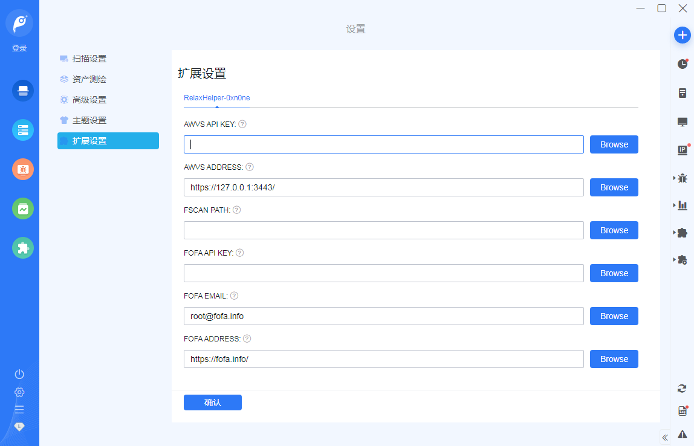

# Relax 助手

简体中文 | [English](./README.md)

使用 Vue + Bootstrap 开发的 Goby 插件，麻了 Goby 插件上传默认文档必须为英文，目前拥有以下功能：

- 导出 Goby 扫描任务的数据
- 使用 AWVS 扫描 WEB 系统
- 使用 FSCAN 扫描应用、弱口令
- 导出 AWVS、FSCAN 扫描任务的漏洞数据
- 使用 FOFA 信息收集，**注：**需VIP
- 将 FOFA 收集到的 IP 添加至 Goby 新建扫描任务中，**注：**目前只能添加一页，最大一页搜索量改成 2000 怎么说也够用了吧

**注意：**

- 导出数据默认导出至插件文件夹的 datadir 目录下
- Windows 数据目录：Goby安装目录\extensions\插件编号、插件名称\datadir
- Mac 数据目录：/Users/当前用户名/goby/extensions/插件编号、插件名称/datadir

项目地址：<https://github.com/0xn0ne/RelaxHelper>

## 快速开始

1. 通过扩展商店安装
2. （可跳过）配置好 AWVS 或 FOFA 的地址、邮箱、API密钥

    

3. 右侧工具栏处点击图标打开 Relax 控制面板

    

4. 开始操作

## 手动安装

### 依赖

- nodejs v16+

### 操作步骤

1. 下载本插件文件
2. 将文件复制到 Goby 的 extensions 插件目录
3. 进入到本插件目录下，使用 `npm install` 命令安装插件依赖
4. 重启 Goby 即可

- Windows 插件目录：C:\Users\当前用户名\goby\extensions\
- Mac 插件目录：/Users/当前用户名/goby/extensions/

## 功能说明

### 导出功能

该功能用于 Goby 扫描任务数据导出，需要进入任务面板后再操作

1. 进入任务面板

    

2. 根据需要勾选导出字段，点击**导出任务数据**即可将当前 Goby 扫描数据导出，路径会出现在提示框

    

3. 点击**保存配置**可以将导出、扫描当前的配置全部保存下来，重新打开 Relax 后就不需要重新勾选了
4. 会导出 CSV 和 JSON 格式的数据，数据内容如下

    

### 扫描功能

该功能用于联动第三方工具，拓展扫描能力，目前仅整了AWVS、FSCAN，需要进入任务面板后再操作

1. 使用前需确认 Goby 插件配置页面的 **AWVS API KEY**、**AWVS ADDRESS**、**FSCAN PATH** 配置是否正确
2. 配置不正确或 AWVS、FSCAN 无法连接的情况下，AWVS 或 FSCAN 扫描是无法启动的，重新配置后重新打开 Goby 才可使用

    

3. 点击**提交扫描任务**可将当前资产提交至启动的扫描系统中进行扫描，会自动筛选 http 或 https 协议的端口到 AWVS 进行扫描，目标数量会和资产数量有差别

    

4. 这里会显示扫描进度和漏洞数量，每次重新打开面板 Relax 都会更新一次数据

    

5. 点击**清空所有目标**会清空 AWVS、FSCAN 中的所有 Targets。**注意：**无论是不是 Relax 添加的 Targets 都会被清空，扫描结果也会被清空
6. 点击**导出数据**会导出 AWVS、FSCAN 当前扫描数据，扫描过程中也可以导出，导出数据如下

    

### 搜索功能

该功能用于联动第三方工具，启动扫描任务，目前仅整了 FOFA，必须是 FOFA VIP 才可以使用 API

1. 使用前需确认 **FOFA API KEY、FOFA EMAIL、** **FOFA ADDRESS** 三项配置是否正确
2. 配置正确的情况下，输入搜索语法，点击搜索即可加载结果

    

3. 选中搜索结果后，打开 Goby 的**新建扫描**任务面板，点击**添加扫描目标**即可将选中的结果添加进 Goby 扫描任务面板

    

### 备注

- 做操作的时候没有弹出提示可能说明连接失败之类的情况，检查一下 AWVS 或 FOFA 的配置是否正确或者能正常连接
- 很久不碰代码了，写得有点乱，我自己看着都头疼，目前还没有弄其他功能打算
- 这是 1 个月赶出来的东西，不要抱太大期望
- 如果有 BUG 请提 Issues

## 操作演示

文件太大太捞了，懒得更新
